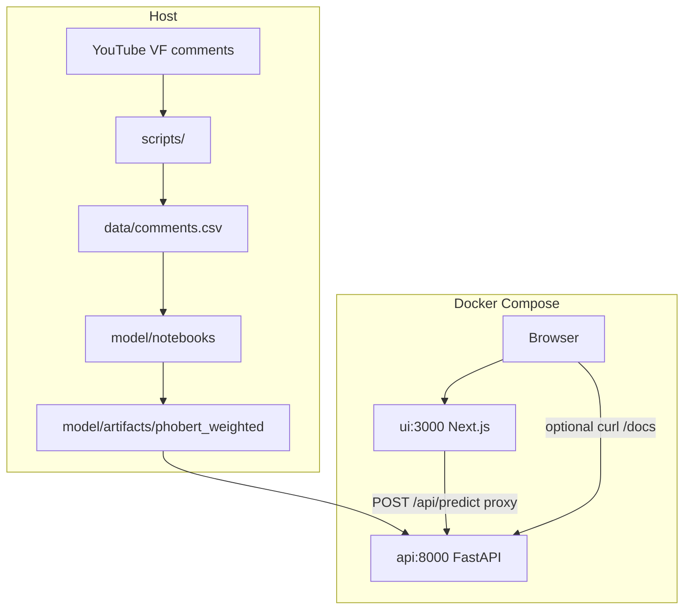

# Architecture

How this repo is shaped, and why. How to run: [README.md](../../README.md).

## How we built it

Train on the host. Compose only serves.



```
YouTube VF comments → scripts/ → data/comments.csv
        → model/notebooks (train on host)
        → model/artifacts (gitignored)
        → api image (COPY weighted weights at build)
Browser → ui:3000 → /api/predict proxy → api:8000 → PhoBERT
```

Notebooks stay on the host so Jupyter, CPU/GPU, and long jobs are not stuffed into Compose.

## Structure

| Path | Job |
|------|-----|
| `data/` | Labeled CSV/JSON |
| `scripts/` | Scrape / clean / export |
| `model/notebooks/` | Train + compare (`.ipynb` so loss and confusion stay visible) |
| `model/artifacts/` | Weights, gitignored |
| `api/` | FastAPI `POST /predict`, `GET /health` |
| `ui/` | Next.js demo; server proxy so the browser never uses Docker-internal hostnames |
| `docs/plan/` | How it was planned (partly stale — spec still mentions Flask) |
| `docs/architecture/architecture.md` | This page |
| `docker-compose.yml` | `api` + `ui` |

API model path (compose, Dockerfile, `api/config.py`): `model/artifacts/phobert_weighted/`. Unweighted `model/artifacts/phobert/` is notebook comparison only and is **not** copied into the API image.

## Why

- **PhoBERT** — Vietnamese tokenizer; fine-tune on a small labeled set. TF-IDF + logistic regression is the baseline so BERT is a comparison, not a vibe.
- **Class weights** — labels are not equal; prefer `phobert_weighted` for the API so the majority class (neutral) does not dominate the loss.
- **Notebooks** — training progress visible; no hidden `.py` train scripts.
- **FastAPI** — typed, OpenAPI `/docs`, small service.
- **Next.js** — optional demo (assignment UI was optional). Proxy to FastAPI.
- **Compose** — same stack after train.
- **No weights in git** — size. Other-dev trains.

## Limits

- Domain is VinFast-style comments; general Vietnamese is untested.
- Sarcasm and mixed sentiment are weak.
- CPU training is slow.

Numbers: [model/report.md](../../model/report.md). Step notes: [docs/plan/](../plan/).
