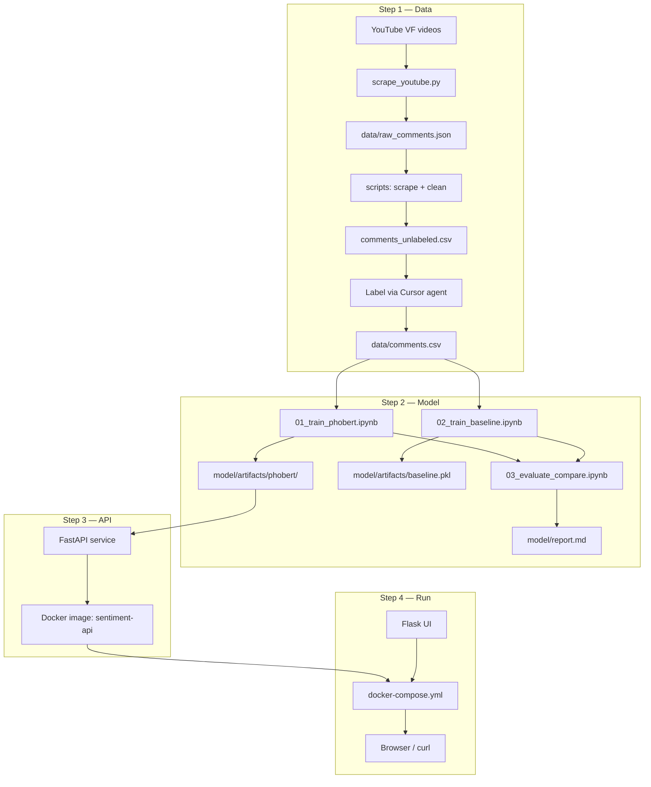

# Design Spec — VinFast Comment Sentiment System

**Assignment:** Test Data System DEV  
**Domain:** Vietnamese YouTube comments about VinFast electric cars (VF3, VF5, VF7, VF8, VF9)  
**Goal:** Scrape real comments → label → train sentiment model → expose via REST API → demo UI, all runnable with `docker compose up`.

---

## Grading map

Plans mirror assignment criteria (`Tiêu chí đánh giá`):

| Step | Plan doc | Assignment criteria | Weight |
|------|----------|---------------------|--------|
| 1 | [step-1-prepare-data-plan.md](./step-1-prepare-data-plan.md) | Chất lượng dữ liệu | 15% |
| 2 | [step-2-build-model-plan.md](./step-2-build-model-plan.md) | Model & phương pháp | 40% |
| 3 | [step-3-api-plan.md](./step-3-api-plan.md) | API & xử lý | 30% |
| 4 | [step-4-ui-and-run-plan.md](./step-4-ui-and-run-plan.md) | Tài liệu (+ optional UI) | 15% |

Step 4 delivers README + one-command Docker run (includes optional Flask UI).

---

## System overview



---

## Tech choices

| Layer | Choice | Why |
|-------|--------|-----|
| Data source | YouTube comments (VinFast VF lineup) | Realistic VN text; high volume; on-topic for car sentiment |
| Labeling | Cursor agent on exported CSV + your review | No LLM API in code; assignment allows AI assist outside pipeline |
| Primary model | Fine-tuned `vinai/phobert-base` | Standard VN NLP baseline; fine-tune on our data = "build model" |
| Baseline model | TF-IDF + Logistic Regression | Fair comparison; shows when BERT worth extra cost |
| API | FastAPI | Simple, typed, auto OpenAPI docs |
| UI | Flask (optional) | Matches assignment suggestion; minimal demo page |
| Deploy | Docker + Docker Compose | Reviewer runs entire stack without local Python/ML setup |
| Model training & eval | **Jupyter notebooks (`.ipynb`)** | See progress inline — loss curves, metrics, confusion matrix visible cell-by-cell |

---

## Code format convention

| Area | Format | Reason |
|------|--------|--------|
| Step 1 — scrape, clean, export CSV | `.py` scripts (SOLID) | Repeatable pipeline; labeling done by you in Cursor |
| **Step 2 — train, test, compare models** | **`.ipynb` notebooks only** | Interactive; see training loss, metrics, sample predictions as they run |
| Step 3 — API inference | `.py` | Production service code, Docker entrypoint |
| Step 4 — UI | `.py` | Flask app, Docker entrypoint |

**No `.py` training scripts.** All model work lives under `model/notebooks/`. Notebooks export artifacts to `model/artifacts/` for API consumption.

---

## Repository layout (target)

```
matgrouptest/
├── data/
│   ├── video_sources.json      # curated VF video list + metadata
│   ├── raw_comments.json       # scraped, unlabeled
│   ├── comments_unlabeled.csv  # script output — sentiment empty
│   └── comments.csv            # you label via Cursor → step 2 input
├── scripts/
│   ├── main.py                 # CLI entry
│   ├── config.py
│   ├── models.py               # dataclasses
│   ├── scraper.py
│   ├── cleaner.py
│   └── exporter.py
├── docs/
│   └── labeling-prompt.md      # optional rules for Cursor agent
├── model/
│   ├── notebooks/
│   │   ├── 00_data_prep_and_split.ipynb   # validate CSV, EDA, stratified split
│   │   ├── 01_train_phobert.ipynb         # fine-tune PhoBERT (approach A)
│   │   ├── 02_train_baseline.ipynb        # TF-IDF + LR (approach B)
│   │   └── 03_evaluate_and_compare.ipynb # metrics, confusion matrix, report
│   ├── artifacts/
│   │   ├── phobert/            # fine-tuned HF model (exported from notebook)
│   │   ├── baseline.pkl
│   │   └── split_indices.json
│   └── report.md               # summary pulled from notebook 03
├── api/
│   ├── main.py
│   ├── schemas.py
│   ├── predictor.py            # load model, run inference
│   └── Dockerfile
├── ui/
│   ├── app.py
│   ├── templates/index.html
│   └── Dockerfile
├── docker-compose.yml
├── requirements.txt
├── .env.example
└── README.md
```

---

## Data schema

**Final file:** `data/comments.csv`

| Column | Type | Description |
|--------|------|-------------|
| `comment` | string | Raw comment text |
| `sentiment` | enum | `positive` \| `negative` \| `neutral` |
| `model` | string | VF3, VF5, VF7, VF8, VF9 |
| `video_id` | string | YouTube video ID |
| `ai_sentiment` | enum | Label from AI (audit trail) |
| `reviewed` | bool | Human reviewed flag |

Target size: **800–1,000** rows after clean + dedupe.

---

## API contract

```
POST /predict
Content-Type: application/json

Request:
{ "text": "VF8 đẹp nhưng giá hơi cao" }

Response 200:
{
  "sentiment": "neutral",
  "confidence": 0.72,
  "probabilities": {
    "positive": 0.15,
    "negative": 0.13,
    "neutral": 0.72
  }
}

GET /health → { "status": "ok", "model_loaded": true }
```

Edge cases: empty text → 400; text truncated if >512 chars (header `X-Text-Truncated: true`).

---

## Docker services

| Service | Image | Port | Role |
|---------|-------|------|------|
| `api` | `sentiment-api` | 8000 | FastAPI + PhoBERT inference |
| `ui` | `sentiment-ui` | 5000 | Flask demo; calls `http://api:8000` |

```bash
docker compose up --build
# API:  http://localhost:8000/docs
# UI:   http://localhost:5000
```

Model artifacts copied into API image at build time (or mounted via volume for dev).

---

## Execution order

1. **Step 1** — Scrape VF videos → clean → `comments_unlabeled.csv` → you label in Cursor → `comments.csv`
2. **Step 2** — Run notebooks: prep/split → PhoBERT → baseline → evaluate/compare → `report.md`
3. **Step 3** — FastAPI + predictor + Dockerfile for API
4. **Step 4** — Flask UI + `docker-compose.yml` + README

Steps 1–2 run on host (data scripts + **Jupyter notebooks** for ML). Steps 3–4 containerized for delivery.

---

## Known limitations (document in README)

- Model tuned on VinFast EV comment style; general VN text untested.
- Sarcasm and mixed sentiment handled by dominant-tone rule during labeling.
- CPU training only — note estimated time; GPU would be faster.
- YouTube scrape depends on video availability; document video list + scrape date.

---

## Success criteria

- [ ] 500–1,000 diverse labeled comments in CSV/JSON
- [ ] Step 2 notebooks run end-to-end; outputs visible (loss, metrics, confusion matrix)
- [ ] PhoBERT fine-tuned with train/val split and metrics explained
- [ ] Baseline model compared on same validation set (notebook 03)
- [ ] `POST /predict` works with edge-case handling
- [ ] `docker compose up` starts API + UI without extra setup
- [ ] README lets reviewer reproduce pipeline end-to-end
