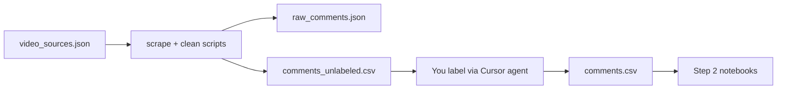

# STEP 1 PLAN — PREPARE DATA (15%)

**Criteria:** Chất lượng dữ liệu — đa dạng, có nhãn hợp lý, không lặp lại máy móc.

**Output (automated scripts):** `data/comments_unlabeled.csv` — 800–1,000 cleaned Vietnamese comments, ready for labeling.  
**Output (after you label):** `data/comments.csv` — same rows with `sentiment` filled in.

---

## Scope

**In scope (code we implement):**
- Scrape real YouTube comments about VinFast VF cars.
- Clean, dedupe, filter spam.
- Export unlabeled CSV for labeling workflow.

**Out of scope (code — you do manually with Cursor / AI agent):**
- Sentiment labeling — no external LLM API calls in this project.
- No `LLM_API_KEY`, no `label_ai.py`, no OpenAI/Claude SDK.

**Labeling workflow:** You open `comments_unlabeled.csv`, use your own AI agent assistant (e.g. Cursor) to fill the `sentiment` column, review results, save as `comments.csv`.

Cover full VF lineup: **VF3, VF5, VF7, VF8, VF9**.

Out of scope: model training (step 2), API, Docker.

---

## Video selection

Pick **10–12** Vietnamese YouTube videos (~2 per model):

| Model | Video types | Examples of search queries |
|-------|-------------|----------------------------|
| VF3 | review, "có nên mua", giá rẻ | `review VinFast VF3`, `VF3 trải nghiệm thực tế` |
| VF5 | review, so VF3 | `VinFast VF5 đánh giá` |
| VF7 | SUV review | `VF7 review`, `VF7 trải nghiệm` |
| VF8 | review, lỗi, owner diary | `VF8 review`, `VF8 sau 6 tháng`, `VF8 lỗi` |
| VF9 | premium, giá cao | `VF9 đánh giá`, `VF9 trải nghiệm` |

Mix video types for sentiment diversity:

- Official / big reviewer (Autopro, Yêu Xe, etc.)
- Owner vlogs ("sau X tháng dùng")
- Compare videos (VF vs competitor)
- Controversy threads (more negative signal)

Save curated list to `data/video_sources.json`:

```json
[
  {
    "video_id": "xxxxxxxxxxx",
    "title": "...",
    "model": "VF8",
    "source_type": "review",
    "url": "https://www.youtube.com/watch?v=xxxxxxxxxxx"
  }
]
```

---

## Pipeline



**Two phases:**
1. **Automated** — scrape → clean → export `comments_unlabeled.csv`
2. **Manual** — label with Cursor agent → save `comments.csv` → quality check → step 2

---

## Code design (implementation rules)

Scripts must be **clean, beginner-friendly, easy to read**. Follow these rules when implementing:

| Rule | Detail |
|------|--------|
| **SOLID** | One class per responsibility (e.g. `YouTubeScraper`, `CommentCleaner`, `CsvExporter`). No god files. |
| **Method comments** | Every public method gets a docstring: what it does, args, return value. |
| **No one-liners** | Avoid dense one-line logic. Use named steps and clear variable names. |
| **Readable flow** | `main()` orchestrates; business logic in classes/functions. |
| **No external AI** | Scripts only scrape, clean, export CSV. Labeling stays outside codebase. |

**Suggested module layout:**

```
scripts/
├── __init__.py
├── main.py                 # CLI entry: scrape | clean | export (or run-all)
├── config.py               # paths, constants, limits
├── models.py               # dataclasses: VideoSource, RawComment, CleanComment
├── scraper.py              # YouTubeScraper
├── cleaner.py              # CommentCleaner
└── exporter.py             # CsvExporter
```

---

## Script flow

### 1. Scrape — `YouTubeScraper` in `scraper.py`

**Tool:** `youtube-comment-downloader` (no API key).

**Behavior:**
- Read `data/video_sources.json`.
- For each video, fetch comments (default order or by relevance if supported).
- Target **~150–200 comments per video** → ~1.8k raw total.
- Sleep between videos (rate limit).
- Log failures; continue on single-video errors.

**Save:** `data/raw_comments.json`

```json
[
  {
    "comment": "VF8 đẹp quá, chạy êm",
    "video_id": "xxx",
    "model": "VF8",
    "author": "...",
    "likes": 12,
    "scraped_at": "2026-08-16"
  }
]
```

---

### 2. Clean — `CommentCleaner` in `cleaner.py`

**Input:** `data/raw_comments.json`  
**Output:** in-memory list of cleaned comments (or intermediate JSON)

**Rules — drop if:**
- Empty or whitespace only
- Length `< 10` characters
- Duplicate text (normalize: lowercase, collapse spaces, strip)
- Spam patterns: `"sub cho"`, `"ai xem tới đây"`, link-only, emoji-only

**Keep:**
- Typos, missing diacritics, emoji mixed with text (realistic).
- Questions, comparisons, short reactions.

**Optional trim:** if still > 1,000 rows after dedupe, cap at 1,000 (keep diverse mix across models/videos — not random blind cut).

**Target:** **800–1,000** rows in final export.

---

### 3. Export — `CsvExporter` in `exporter.py`

**Input:** cleaned comments  
**Output:** `data/comments_unlabeled.csv`

**Columns:**

| Column | Description |
|--------|-------------|
| `comment` | Raw comment text |
| `sentiment` | **Empty** — you fill via Cursor agent |
| `model` | VF3, VF5, VF7, VF8, VF9 |
| `video_id` | YouTube video ID |
| `reviewed` | Default `false` — set `true` after you verify label |

Example row before labeling:

```csv
comment,sentiment,model,video_id,reviewed
"VF8 đẹp quá chạy êm",,VF8,abc123,false
```

No `ai_sentiment` column — labeling is manual/agent-assisted outside scripts.

---

## Labeling (manual — Cursor agent, not code)

Assignment allows AI assist for labels but requires **review before training**. You do this outside the Python pipeline.

### Steps for you

1. Open `data/comments_unlabeled.csv` in Cursor.
2. Ask your AI agent to label `sentiment` column using rules below.
3. Review and fix obvious mistakes (especially sarcasm, mixed tone).
4. Set `reviewed=true` for checked rows.
5. Save final file as **`data/comments.csv`**.

### Labeling rules (give these to your Cursor agent)

**Allowed values:** `positive`, `negative`, `neutral` only.

| Label | When to use |
|-------|-------------|
| **positive** | Praise, satisfaction, recommend, pride |
| **negative** | Complaint, disappointment, quality/service issues |
| **neutral** | Questions, specs, comparisons without clear opinion |

**Edge cases:**
- Mixed ("đẹp nhưng giá cao") → **dominant tone**, or `neutral` if balanced
- `"Xe đẹp quá... sạc ở đâu?"` → `neutral` (question), not positive
- VinFast quality complaints on VF8 → `negative`
- Spam leftover → delete row or leave unlabeled and drop before step 2

**Optional:** save agent prompt in `docs/labeling-prompt.md` for reproducibility (README can link to it).

---

## Quality checks (before handoff to step 2)

Run after you save `data/comments.csv` (notebook cell or small script — not required for step 1 deliverables):

```python
assert 500 <= len(df) <= 1000
assert df["sentiment"].isin(["positive", "negative", "neutral"]).all()
assert df["comment"].str.len().min() >= 10
assert df["comment"].duplicated().sum() == 0
```

Also verify:
- All 5 models represented
- Mix of short/long comments
- No single video > 25% of dataset
- Label distribution roughly balanced (see targets below)

---

## Label distribution target

Real YouTube data may skew neutral. Acceptable ranges after labeling:

| Label | Target share |
|-------|--------------|
| positive | 25–40% |
| negative | 25–40% |
| neutral | 20–35% |

If imbalanced, add more videos and re-scrape — do not blindly relabel to hit quotas.

---

## CLI usage (target)

```bash
# run full automated pipeline
python -m scripts.main run-all

# or step by step
python -m scripts.main scrape
python -m scripts.main clean
python -m scripts.main export
```

---

## Dependencies (step 1 only)

```
youtube-comment-downloader
pandas
```

No `openai`, no `python-dotenv` for LLM keys.

Add to root `requirements.txt` as project grows.

---

## Deliverables

| File | Description |
|------|-------------|
| `data/video_sources.json` | Curated VF video list (you curate; can commit template) |
| `data/raw_comments.json` | Raw scrape output |
| `data/comments_unlabeled.csv` | **Script output** — ready for labeling |
| `data/comments.csv` | **You produce** — labeled final dataset |
| `scripts/` | Scrape, clean, export modules (SOLID layout) |
| `docs/labeling-prompt.md` | Optional — prompt/rules for Cursor agent |

**Not delivered:**
- ~~`scripts/label_ai.py`~~
- ~~`.env.example` with LLM key~~

---

## Risks

| Risk | Mitigation |
|------|------------|
| Video removed / comments disabled | Backup videos in `video_sources.json` |
| Over-scrape spam | Cleaner rules + spot check before labeling |
| Agent mislabels sarcasm | Review pass; document rules in labeling prompt |
| Class imbalance | Diverse video selection; report honestly in README |
| Empty `sentiment` rows | Assert before step 2; drop or relabel |

---

## Execution order

1. Curate 10–12 VF videos → `video_sources.json`
2. Run scrape → `raw_comments.json`
3. Run clean + export → `comments_unlabeled.csv`
4. **You:** label with Cursor agent → `comments.csv`
5. Quality checks → hand off to step 2

**Implementation:** wait for your approval after reviewing this plan.
