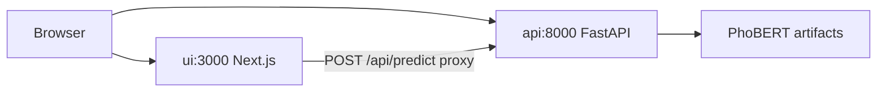

# STEP 4 PLAN — UI, DOCKER COMPOSE & DOCUMENTATION (15%)

**Criteria:** Tài liệu — README đủ để người khác chạy lại được; plus optional UI per assignment.

**Output:** `docker compose up` starts API + demo UI; README covers full pipeline.

---

## Scope

- Optional **Next.js** web UI (text in → sentiment + confidence out).
- `docker-compose.yml` wires API + UI together.
- Root `README.md` — single entry point for reviewers.
- Fold `model/report.md` findings into README.

Out of scope: new model training, data scraping automation in Docker (steps 1–2 stay host-side).

---

## Docker Compose architecture



### `docker-compose.yml`

```yaml
services:
  api:
    build:
      context: .
      dockerfile: api/Dockerfile
    ports:
      - "8000:8000"
    environment:
      MODEL_PATH: /app/model/artifacts/phobert
      MAX_TEXT_LEN: "512"
    healthcheck:
      test:
        [
          "CMD",
          "python",
          "-c",
          "import urllib.request; urllib.request.urlopen('http://localhost:8000/health')",
        ]
      interval: 10s
      timeout: 5s
      retries: 5
      start_period: 60s

  ui:
    build:
      context: ./ui
      dockerfile: Dockerfile
    ports:
      - "3000:3000"
    environment:
      API_URL: http://api:8000
    depends_on:
      api:
        condition: service_healthy
```

**Reviewer experience:**
```bash
git clone <repo>
cd matgrouptest
docker compose up --build -d
# open http://localhost:3000  (UI)
# open http://localhost:8000/docs  (API Swagger)
```

Pre-trained model must exist in `model/artifacts/phobert/` before build (committed or download script documented).

---

## Next.js UI

### Why Next.js (not Flask)

- Modern React stack with Tailwind v4 — easier to make a polished optional demo UI.
- Server-side API route proxies to FastAPI — browser never needs Docker-internal hostnames.
- Standalone Docker output keeps the UI image small.

### Layout — `ui/`

```
ui/
├── Dockerfile
├── package.json
├── next.config.ts
├── src/
│   ├── app/
│   │   ├── layout.tsx
│   │   ├── page.tsx
│   │   ├── globals.css
│   │   └── api/predict/route.ts   # proxy → FastAPI
│   └── components/
│       └── SentimentForm.tsx
└── public/
```

### `SentimentForm.tsx`

- Textarea + submit button.
- Client validation: empty/whitespace, max 512 chars, live char counter.
- Calls `/api/predict` (Next.js route), not FastAPI directly.
- Display: sentiment badge + confidence + probability bars.
- Loading skeleton, inline errors, truncated-input warning.

### `src/app/api/predict/route.ts`

- Server-side proxy to `{API_URL}/predict`.
- Forwards status codes and `X-Text-Truncated` header from API.

### `ui/Dockerfile`

Multi-stage Node 20 Alpine build with `output: "standalone"`:

```dockerfile
FROM node:20-alpine AS deps
WORKDIR /app
COPY package.json package-lock.json* ./
RUN npm install

FROM node:20-alpine AS builder
WORKDIR /app
COPY --from=deps /app/node_modules ./node_modules
COPY . .
RUN npm run build

FROM node:20-alpine AS runner
WORKDIR /app
ENV NODE_ENV=production
ENV PORT=3000
ENV HOSTNAME=0.0.0.0
RUN addgroup --system --gid 1001 nodejs && adduser --system --uid 1001 nextjs
COPY --from=builder /app/public ./public
COPY --from=builder --chown=nextjs:nodejs /app/.next/standalone ./
COPY --from=builder --chown=nextjs:nodejs /app/.next/static ./.next/static
USER nextjs
EXPOSE 3000
CMD ["node", "server.js"]
```

**Env vars:**

| Var | Default (dev) | Docker |
|-----|---------------|--------|
| `API_URL` | `http://localhost:8000` | `http://api:8000` |

---

## Local dev (without Docker)

Terminal 1 — API:
```bash
source .venv/bin/activate
export MODEL_PATH=model/artifacts/phobert
uvicorn api.main:app --reload --port 8000
```

Terminal 2 — UI:
```bash
cd ui
npm install
npm run dev
# open http://localhost:3000
```

---

## README structure

Single `README.md` at repo root. Reviewer should not need to ask questions.

### 1. Overview
- What the project does (VinFast comment sentiment).
- Architecture diagram (link to `docs/plan/00-design-spec.md`).

### 2. Quick start (Docker — primary path)
```bash
docker compose up --build -d
```
- UI: http://localhost:3000
- API: http://localhost:8000/docs

### 3. Full pipeline (reproduce from scratch)
1. Step 1 — scrape & export (`python -m scripts.main run-all`), then label `comments_unlabeled.csv` in Cursor → `comments.csv`
2. Step 2 — run Jupyter notebooks in `model/notebooks/` (00 → 01 → 02 → 03), then check `model/artifacts/`
3. Step 3–4 — build & run Docker stack

### 4. Data
- Source: YouTube VinFast VF3/VF5/VF7/VF8/VF9 comments
- Labeling: Cursor agent on exported CSV + your review (no LLM API in code)
- Final stats: row count, label distribution, correction rate

### 5. Model
- **Notebooks:** step 2 is Jupyter-only — open `model/notebooks/` in order (00→03)
- Why PhoBERT (link/summary from `model/report.md`)
- Baseline comparison table (macro-F1, accuracy, confusion matrix — from notebook 03)
- Why macro-F1 as primary metric
- CPU training note + GPU alternative

### 6. API reference
- `POST /predict` request/response examples
- Edge cases handled
- curl examples

### 7. Limitations
- VinFast-domain bias
- Sarcasm edge cases
- Docker image size / CPU inference latency

### 8. Project structure
- Brief folder map

---

## Additional docs

| File | Purpose |
|------|---------|
| `model/report.md` | Detailed metrics + model comparison (step 2 output) |
| `docs/plan/00-design-spec.md` | Design spec for reviewers who want depth |
| `docs/labeling-prompt.md` | Optional labeling rules for Cursor agent |

---

## Pre-submit checklist

- [ ] `docker compose up --build -d` works on clean machine (model artifacts present)
- [ ] UI submits text → shows sentiment + confidence
- [ ] API `/docs` accessible
- [ ] README quick start tested
- [ ] No secrets in git (`.env` gitignored)
- [ ] `model/report.md` linked or summarized in README
- [ ] Assignment PDF requirements mapped (data / model / API / docs)

---

## Model artifacts strategy

**Option A (recommended for assignment):** Commit fine-tuned `model/artifacts/phobert/` (~500MB–1GB) or use Git LFS.

**Option B:** Document download link in README (Google Drive / release asset) if repo size is concern.

Reviewer must run Docker **without retraining**. State clearly in README which option used.

---

## Deliverables

| File | Description |
|------|-------------|
| `docker-compose.yml` | Orchestrates api + ui |
| `ui/` | Next.js demo app |
| `ui/Dockerfile` | UI container |
| `README.md` | Main documentation |
| `.env.example` | Env template |
| `.gitignore` | `.env`, `__pycache__`, optional large artifacts |

---

## Execution order

1. Build Next.js UI with API proxy route (dev mode against local FastAPI)
2. Write `ui/Dockerfile`
3. Wire `docker-compose.yml` with healthcheck + depends_on
4. Test full stack: `docker compose up --build -d`
5. Write README (quick start first, then full pipeline)
6. Final review against assignment criteria
